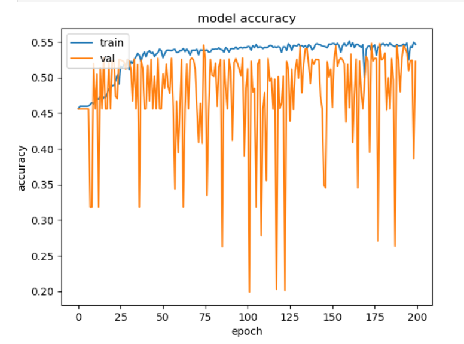

# CSE151A_UrbanAnimals
Unveiling patterns: predictive modeling of animal disposition in urban settings.
Link to project notebook: https://github.com/PaulaEsteban2000/CSE151A_UrbanAnimals/blob/8d883ee58b6b1c4a9531b54182da76779e851f41/notebook.ipynb

__Abstract:__
With the increasing volume of animals picked up by urban animal control centers, understanding and predicting the outcomes of these incidents have become crucial for effective management and resource allocation. In this study, we leverage a comprehensive 7-year dataset from Baton Rouge Animal Control and Rescue Center (ACRC) to develop a machine learning model that predicts the disposition of animals based on a variety of characteristics such as incident date, request type, location, species, breed, sex, size, age, condition, temperament, etc. The results of our study will not only contribute to a deeper understanding of the factors influencing animal outcomes but will also provide a practical tool for animal control centers to anticipate the disposition of animals in their care. This supervised predictive model can aid in prioritizing resources, optimizing intervention strategies, and ultimately improving the welfare of animals within urban communities.

__Project Goal:__
Our goal is to take the data collected from animal control calls, and to be able to determine how many animal controllers should be sent to the location the call is coming from, depending on the predicted behaviour of the animal called upon. In other words, we are trying to predict the behaviour of each animal species depending on the time of the year, to subsequently predict how mnay animal controllers should be attending each call and possibly help them decide the tools to use in each task. 
To go further,  we'll be plotting various information graphs to see if we might figure out anything that may not been expected. We are taking the data and using incident dates , breed, sex, location, size, etc, to determine the possible temperament of an animal. There are numerous factors that can contribute to an animal being more docile or hostile, whether its mating season, spring/winter, animal type, breed, age, sex, if its injured, etc. Using all this information we should be able to predict if an animal control request is going to impose any danger on the caller or responders, or how high of a priority a call is.

__Preprocessing data:__
We wanted to select all the relevant columns of our data. But there were many values that had NA or unknown.
We took every value that was unknown, replaced it with NaN, and dropped it from our table.

We used a histogram to plot "species", "breed", "sex", "size", "condition".
Noticing many different breeds, we wanted to clean it up so we created a consolidated breed table using some lambda functions to strip away characters so that we could group the correct breeds with each other.
For example, some values were 'XRetriever', or 'X Retriever', this is redundant. They are the same breed, we changed it so its simply 'Retriever'

We also wanted to take the more common breeds and to group them by type. This way, as we are planning to do one-hot encoding, future related tasks will be easier.
For example 'Cocker Spaniel' 'Springer Spaniel' is a type of 'spaniel', 'Rooster' is a type of 'Chicken'. 

__Graphs:__
Using our processed consolidated breed data, we wanted to do some more analysis
We did some histograms of species by species sex ,conditions, sizes.

We wanted to check which dogs were most commonly reported for incidents. We did a histogram and noticed the primary dog breed that was called was pitbull by a vast majority. Pitbulls were called in almost 4x more than the second dog breed "Labrador".

Finally, we looked at the condition the dogs where in.

__First model training:__
We have started to work separately into different groups, each developing a different first mode simultaneaously: decision tree, logistical regression, perceptron and SVM.

After getting to some promising conclussions in decission trees, neural network and perceptrons, we decided the first model we are presenting is the perceptron. This is because both train and test accuracies present similar proper results. The test and train accuracies are about 0.5319 and 0.5371, respectively. We are getting a higher rate of accuracy than expected on the model, making results convincing at the end, so we can infer our model is not overfitting them. If we were to improve the mode, we could definitely try different activation functions, using a different learning rate, and adjusting the number of nodes per layer. This would be done with hyperparameter tuning to find the best parameters given the large number of different possible combinations.

The next two models we are thinking of developing are a decision tree and possibly either neural network or SVM. This is because as said before, the work we've already started to make progress on seems promising on these models. SVM seems to do a good job with multivariable classification, so perhaps developing that model would be useful.

Here is the link to the perceptron notebook: https://github.com/PaulaEsteban2000/CSE151A_UrbanAnimals/blob/main/perceptron.ipynb

__Second model training:__
On this next turn-in, we're leaning towards going with decision tree for miletsone 4. Like we mentioned earlier on this README file, we tried different models when we first started our project, and eventhough our neural network achieved better initial performance than our decision tree, we feel like the decision tree has more options for hyperparameter tuning. Therefore, we are picking decision tree for this milestone because we think that with more time in our hands, we'll be able to dive deeper into tuning the decision tree to get a final better result on our project. 

Nevertheless, we first tried working with our logistic NN to see which results we would be able to get. We first evaluated our data, and we still think it works well enough with what we're trying to achieve, so we trained our neural network with added activation functions and layers.
We haven't done any parameter tuning, feature extension or K-fold cross validation in our model, which might explain why the accuracy value was not too high. We might have taken into consideration one of these methods to improve our model's accuracy.

Our NN model fit and had better performance. Its clear that in our first model the test accuracy was fluctuating too much thus showing that it was not being trained very well and might show underfitting signs. Our new NN model shows that the test error is relatively low and in the same range from around [0.1295,.1310], it shows that the model was relatively well.
Here is a graph showing the results we got:

Here is the link to the logistical neural network notebook: https://github.com/PaulaEsteban2000/CSE151A_UrbanAnimals/blob/main/logistical_regr.ipynb

Like we just mentioned above, our final decision was to go with the deicion tree because it achieved better performance than model 1 and the logistic NN. We haven't done any hyperparameter tuning, but we believe it would be useful for acquiring better performance, and we will try to work on it once we have more time. Here are the promising fitting results:

Here is the link to the decistion treek notebook https://github.com/PaulaEsteban2000/CSE151A_UrbanAnimals/blob/main/decisiontree_notebook.ipynb

We are thinking about finishing and improving our SVM model for the next milestone. This is because as said before on this README, SVM seems to do a good job with multivariable classification, so perhaps developing that model would be useful for our particular dataset.
